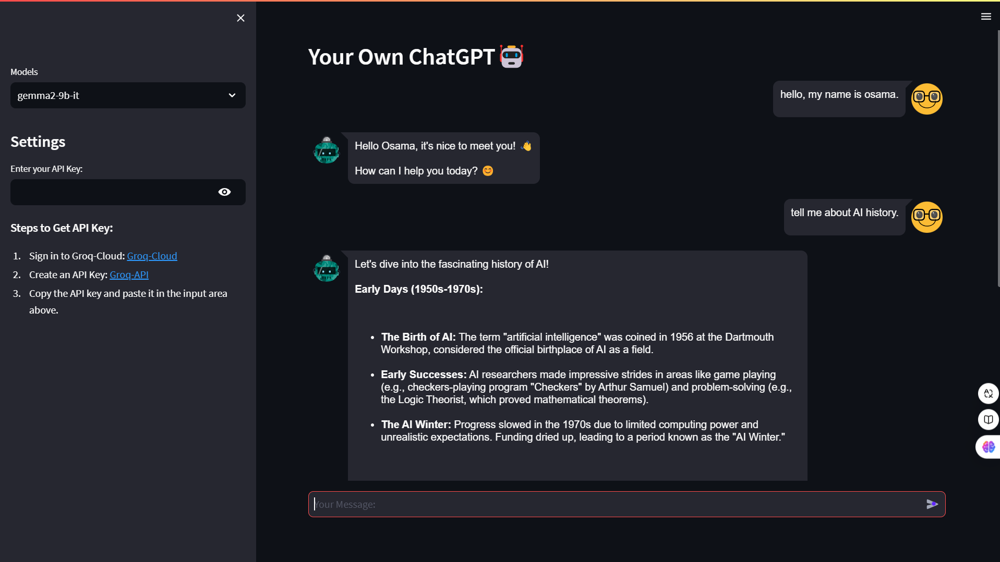

# RAG-Clone-ChatGPT

RAG-Clone-ChatGPT is a Streamlit-based application that allows users to interact with a customized conversational AI assistant. This project leverages Groq models for dynamic and responsive conversational capabilities.

## Features

- **Custom Model Selection:** Choose from various pre-trained models such as `gemma2-9b-it`, `llama-3.3-70b-versatile`, `llama-3.1-8b-instant`, and `mixtral-8x7b-32768`.
- **Groq API Integration:** Easily configure the Groq API for enhanced conversational AI capabilities.
- **Streamlit Chat Interface:** A user-friendly chat interface using `streamlit_chat` for seamless interactions.
- **Dynamic Session Management:** Maintains the context of conversations within the session.

## Demo



## Installation

1. Clone the repository:
   ```bash
   git clone https://github.com/Osama-Abo-Bakr/RAG-Clone-ChatGPT.git
   cd RAG-Clone-ChatGPT
   ```

2. Create a virtual environment and activate it:
   ```bash
   python -m venv venv
   source venv/bin/activate  # On Windows: venv\Scripts\activate
   ```

3. Install dependencies:
   ```bash
   pip install -r requirements.txt
   ```

4. Create a `.env` file in the root directory and add your Groq API key:
   ```env
   GROQ_API_KEY=your_api_key_here
   ```

## Usage

1. Run the Streamlit application:
   ```bash
   streamlit run app.py
   ```

2. Open the application in your browser at `http://localhost:8501`.

3. Interact with the chatbot by selecting a model from the sidebar and entering your Groq API key.

## API Key Configuration

To use the application, you need a Groq API key:

1. Sign in to Groq-Cloud: [Groq-Cloud](https://console.groq.com/keys)
2. Create an API Key: [Groq-API](https://console.groq.com/keys)
3. Copy the API key and paste it in the input area in the sidebar or add it to the `.env` file.

## Project Structure

```plaintext
RAG-Clone-ChatGPT/
├── app.py                 # Main application script
├── requirements.txt       # Python dependencies
├── .env                   # Environment variables
├── README.md              # Project documentation
```

## Dependencies

- **Python:** 3.8+
- **Streamlit:** Interactive web interface
- **streamlit_chat:** Custom chat components
- **langchain_groq:** For conversational AI
- **dotenv:** Environment variable management

## Contributing

Contributions are welcome! If you have suggestions or improvements, please submit a pull request or open an issue.

## License

This project is licensed under the [MIT License](LICENSE).

## Author

Developed by [Osama Abo Bakr](https://github.com/Osama-Abo-Bakr).

## Links

- **Repository:** [RAG-Clone-ChatGPT](https://github.com/Osama-Abo-Bakr/RAG-Clone-ChatGPT.git)
- **Groq Cloud:** [Groq-Cloud](https://console.groq.com/keys)
